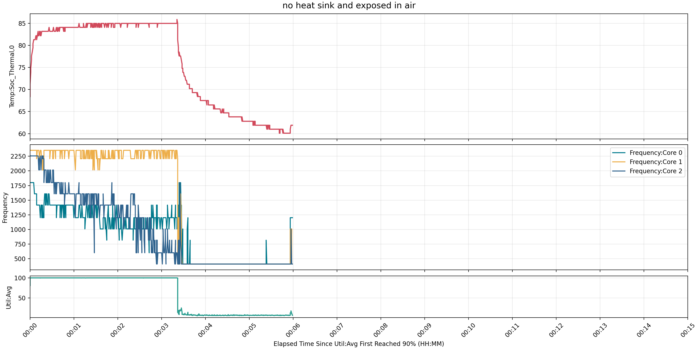
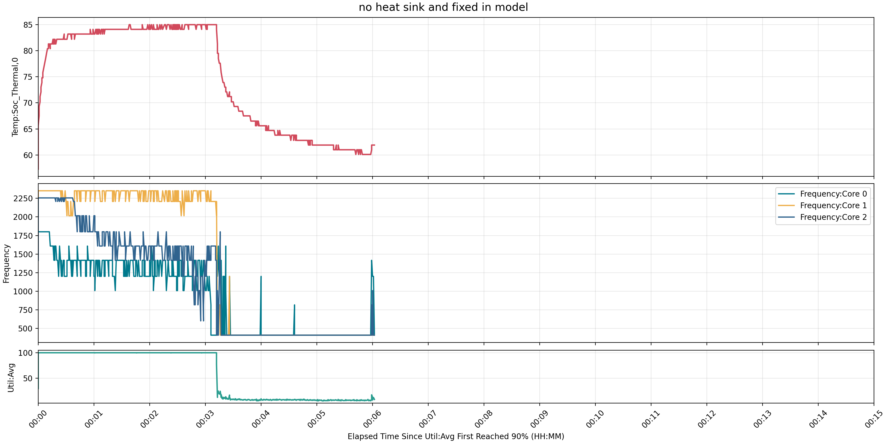
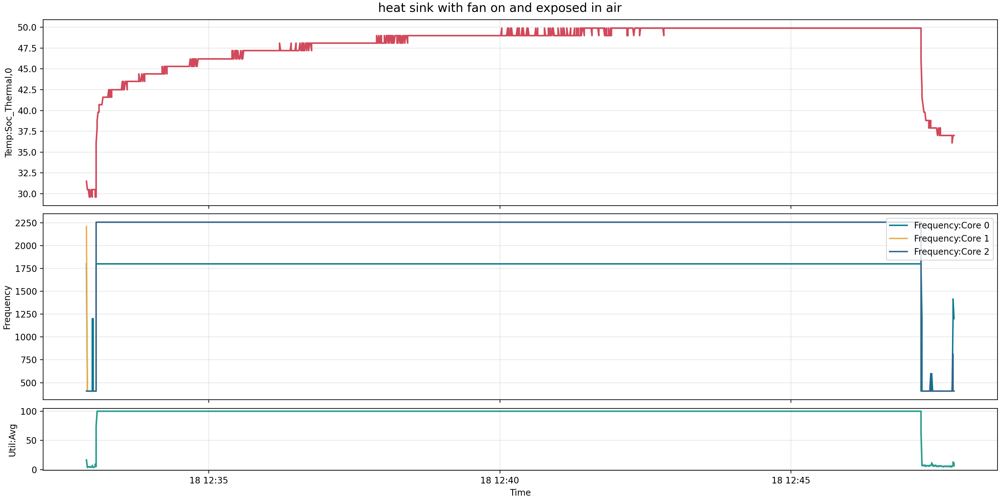
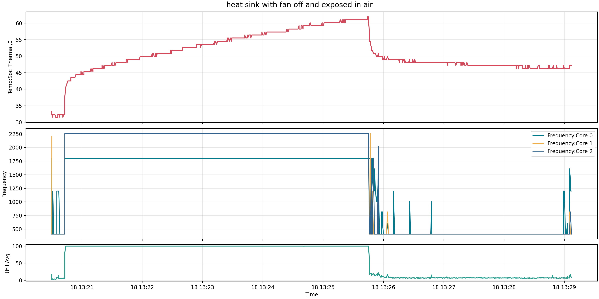
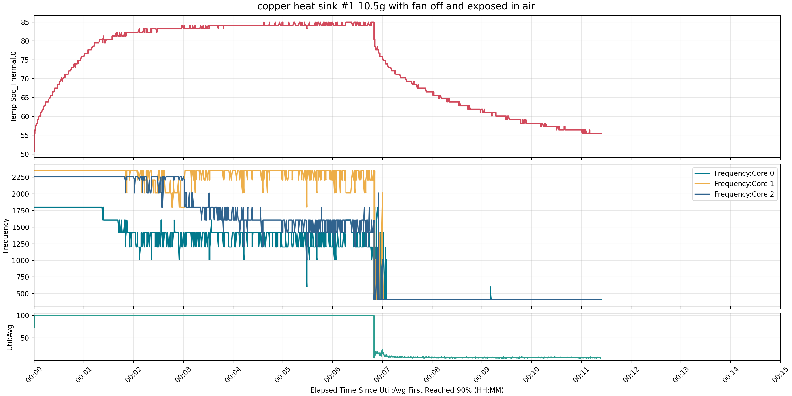
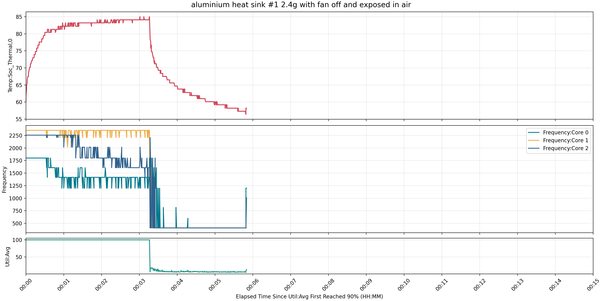
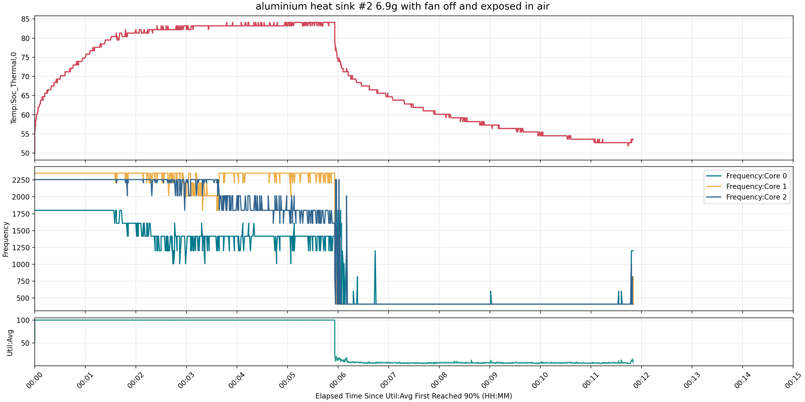

# RESULT

本文件由 `generate_result_md.py` 自动生成，用于汇总每组实验的测试条件、结果图表和对应测试照片。

## Summary

| No. | Condition | Plot | Photo |
| --- | --- | --- | --- |
| 1 | no heat sink and exposed in air | [`s-tui_log_2026-03-18_12_06_24.png`](plots/s-tui_log_2026-03-18_12_06_24.png) | N/A |
| 2 | no heat sink and fixed in model | [`s-tui_log_2026-03-18_12_23_39.png`](plots/s-tui_log_2026-03-18_12_23_39.png) | N/A |
| 3 | stock heat sink with fan on and exposed in air | [`s-tui_log_2026-03-18_12_32_54.png`](plots/s-tui_log_2026-03-18_12_32_54.png) | [`stock heat sink.jpg`](img/stock%20heat%20sink.jpg) |
| 4 | stock heat sink with fan off and exposed in air | [`s-tui_log_2026-03-18_13_20_30.png`](plots/s-tui_log_2026-03-18_13_20_30.png) | [`stock heat sink.jpg`](img/stock%20heat%20sink.jpg) |
| 5 | copper heat sink #1 10.5g with fan off and exposed in air | [`s-tui_log_2026-03-23_03_33_44.png`](plots/s-tui_log_2026-03-23_03_33_44.png) | [`copper heat sink #1.jpg`](img/copper%20heat%20sink%20%231.jpg) |
| 6 | aluminium heat sink #1 2.4g with fan off and exposed in air | [`s-tui_log_2026-03-23_04_00_40.png`](plots/s-tui_log_2026-03-23_04_00_40.png) | [`aluminium heat sink #1.jpg`](img/aluminium%20heat%20sink%20%231.jpg) |
| 7 | aluminium heat sink #2 6.9g with fan off and exposed in air | [`s-tui_log_2026-03-23_04_09_27.png`](plots/s-tui_log_2026-03-23_04_09_27.png) | [`aluminium heat sink #2.jpg`](img/aluminium%20heat%20sink%20%232.jpg) |

## 1. no heat sink and exposed in air

- CSV: `data/s-tui_log_2026-03-18_12_06_24.csv`
- Plot: `plots/s-tui_log_2026-03-18_12_06_24.png`
- Photo: 暂无对应测试照片

### Plot

### Test Photo

暂无对应测试照片。

## 2. no heat sink and fixed in model

- CSV: `data/s-tui_log_2026-03-18_12_23_39.csv`
- Plot: `plots/s-tui_log_2026-03-18_12_23_39.png`
- Photo: 暂无对应测试照片

### Plot

### Test Photo

暂无对应测试照片。

## 3. stock heat sink with fan on and exposed in air

- CSV: `data/s-tui_log_2026-03-18_12_32_54.csv`
- Plot: `plots/s-tui_log_2026-03-18_12_32_54.png`
- Photo: `img/stock heat sink.jpg`

### Plot

### Test Photo

## 4. stock heat sink with fan off and exposed in air

- CSV: `data/s-tui_log_2026-03-18_13_20_30.csv`
- Plot: `plots/s-tui_log_2026-03-18_13_20_30.png`
- Photo: `img/stock heat sink.jpg`

### Plot

### Test Photo

## 5. copper heat sink #1 10.5g with fan off and exposed in air

- CSV: `data/s-tui_log_2026-03-23_03_33_44.csv`
- Plot: `plots/s-tui_log_2026-03-23_03_33_44.png`
- Photo: `img/copper heat sink #1.jpg`

### Plot

### Test Photo

## 6. aluminium heat sink #1 2.4g with fan off and exposed in air

- CSV: `data/s-tui_log_2026-03-23_04_00_40.csv`
- Plot: `plots/s-tui_log_2026-03-23_04_00_40.png`
- Photo: `img/aluminium heat sink #1.jpg`

### Plot

### Test Photo

## 7. aluminium heat sink #2 6.9g with fan off and exposed in air

- CSV: `data/s-tui_log_2026-03-23_04_09_27.csv`
- Plot: `plots/s-tui_log_2026-03-23_04_09_27.png`
- Photo: `img/aluminium heat sink #2.jpg`

### Plot

### Test Photo

